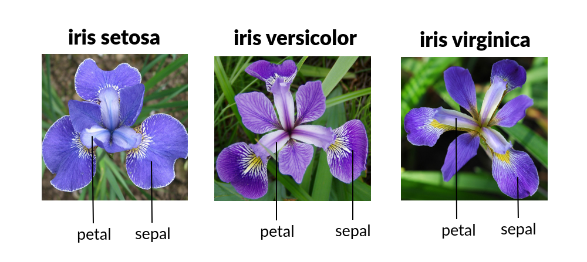

[](https://www.python.org/)
[]((https://github.com/Yarlagadda-saimanoj/Iris-Flower-Classifier/blob/main/LICENSE))
[](https://iris-flower-classifier-saimanoj-yarlagadda.streamlit.app/)
# Iris Flower Classifier



## Overview

The [Iris Flower Classifier](https://iris-flower-classifier-saimanoj-yarlagadda.streamlit.app/) is a machine learning project that predicts the species of an Iris flower based on its petal and sepal measurements. It uses a logistic regression model trained on the famous Iris dataset. This project is a simple example of a supervised classification task in the field of machine learning.


## Installation

Use the package manager [pip](https://pip.pypa.io/en/stable/) to install the required dependencies.

```bash
pip install -r requirements.txt
```

## Usage

To run the Iris Flower Classifier, execute the following command in your terminal:

```bash
streamlit run streamlit_app.py
```

This will launch a Streamlit web application where you can interact with the classifier.

## Tech Stack

- **Languages:** 
- **Libraries:** 
  
  
  
  

## License

This project is distributed under the terms of the [MIT License](LICENSE).

[](LICENSE)
